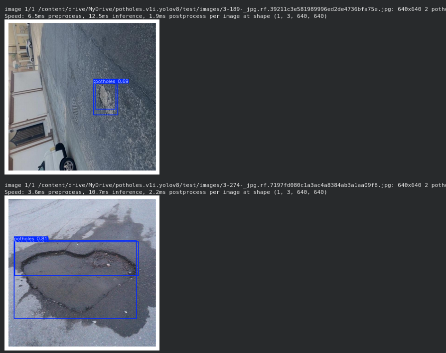

# YOLOv8 Pothole Detection

## Project Overview
This project demonstrates the training and deployment of YOLOv8 models for detecting potholes in road images. The goal is to provide a robust solution for identifying road imperfections, which can be crucial for road maintenance and safety applications.

## Table of Contents
1. [Features](#features)
2. [Getting Started](#getting-started)
   - [Prerequisites](#prerequisites)
   - [Installation](#installation)
3. [Dataset](#dataset)
4. [Training](#training)
5. [Inference](#inference)
   - [Model Performance](#model-performance)
   - [Real-time Inference](#real-time-inference)
6. [Exported Model (ONNX)](#exported-model-onnx)
7. [Acknowledgements](#acknowledgements)
8. [Screenshots of Detection Outputs](#screenshots-of-detection-outputs)

## Features
- Pothole detection using YOLOv8 (nano, small, and medium variants).
- Training on a custom dataset (`potholes.v1i.yolov8`).
- Performance evaluation with mAP50, mAP50-95, Precision, and Recall metrics.
- Export of the best-performing model to ONNX format for optimized deployment.
- Demonstration of inference with both `.pt` and ONNX models.
- Discussion of real-time inference considerations and deployment strategies.

## Getting Started

### Prerequisites
- Python 3.8+
- Git
- Google Drive (for dataset storage, if following this notebook exactly)
- A GPU (recommended for faster training and inference)

### Installation
1. **Clone the repository:**
   ```bash
   git clone https://github.com/MikeTx56/yolov8-pothole-detection.git
   cd yolov8-pothole-detection
   ```
2. **Create a virtual environment (optional but recommended):**
   ```bash
   python -m venv venv
   source venv/bin/activate # On Windows use `venv\Scripts\activate`
   ```
3. **Install dependencies:**
   ```bash
   pip install -r requirements.txt
   ```

## Dataset
The project utilizes the `potholes.v1i.yolov8` dataset. This dataset is expected to be stored in your Google Drive at `/content/drive/MyDrive/potholes.v1i.yolov8`.

Dataset link:
- [Potholes Dataset](https://drive.google.com/drive/folders/1vrS049Jvw5LT7Z3crwx3d010phwfTWqO?usp=drive_link)

Ensure the dataset contains `data.yaml`, `train/`, `valid/`, and `test/` directories with images and corresponding labels.

To use your own dataset, update the `DATASET_PATH` variable in the notebook and modify `data.yaml` as needed.

## Training
The YOLOv8 models (nano, small, medium) were trained for 10 epochs with an image size of 640x640 and a batch size of 16.

```python
from ultralytics import YOLO

DATA_YAML = "/content/drive/MyDrive/potholes.v1i.yolov8/data.yaml"

# YOLOv8n Training
model_n = YOLO("yolov8n.pt")
results_n = model_n.train(data=DATA_YAML, epochs=10, imgsz=640, batch=16, name="yolov8n_custom")

# YOLOv8s Training
model_s = YOLO("yolov8s.pt")
results_s = model_s.train(data=DATA_YAML, epochs=10, imgsz=640, batch=16, name="yolov8s_custom")

# YOLOv8m Training
model_m = YOLO("yolov8m.pt")
results_m = model_m.train(data=DATA_YAML, epochs=10, imgsz=640, batch=16, name="yolov8m_custom")
```

Training results, including plots and best weights, are saved in the `runs/detect/` directory.

## Inference

### Model Performance
Here's a comparison of the trained models based on validation metrics after training:

| Model          | mAP50 | mAP50-95 | Precision | Recall | Training Time (Epochs) | Inference Speed (ms/img) | Model Size (MB) |
| :------------- | :---- | :------- | :-------- | :----- | :--------------------- | :----------------------- | :-------------- |
| YOLOv8n        | 0.845 | 0.463    | 0.840     | 0.732  | 10 (partial logs)      | 4.6                      | ~12             |
| YOLOv8s        | 0.897 | 0.526    | 0.850     | 0.851  | 10 (partial logs)      | 10.1                     | ~44             |
| YOLOv8m        | 0.671 | 0.338    | 0.617     | 0.606  | 10 (partial logs)      | 23.3                     | ~103            |
| YOLOv8s (ONNX) | N/A   | N/A      | N/A       | N/A    | N/A                    | 21.8                     | 42.7            |

The `yolov8s_custom` model showed the best overall performance among the `.pt` models after training.

### How to Run Inference

To run inference on an image using the trained `.pt` model:

```python
from ultralytics import YOLO
import matplotlib.pyplot as plt
import cv2
import os

TEST_IMAGES = "/content/drive/MyDrive/potholes.v1i.yolov8/test/images"
img_path = os.path.join(TEST_IMAGES, "sample_image.jpg")  # Replace with your image path

trained_model_s = YOLO("runs/detect/yolov8s_custom/weights/best.pt")
results = trained_model_s(img_path)

for r in results:
    im_array = r.plot()  # draw boxes
    plt.imshow(cv2.cvtColor(im_array, cv2.COLOR_BGR2RGB))
    plt.axis("off")
    plt.show()
```

### Real-time Inference
For real-time applications, you would typically integrate the ONNX model with a video stream (webcam or file). The process involves:

1. Capturing frames using `cv2.VideoCapture`.
2. Preprocessing frames to match model input.
3. Running inference with the ONNX model.
4. Post-processing predictions (boxes and confidence).
5. Displaying detections in a loop.

## Exported Model (ONNX)
The `yolov8s_custom` model, identified as the best performer, was exported to ONNX format for deployment flexibility and optimized inference. The exported model is located at `runs/detect/yolov8s_custom/weights/best.onnx`.

```python
from ultralytics import YOLO

trained_model_s = YOLO("runs/detect/yolov8s_custom/weights/best.pt")
trained_model_s.export(format="onnx")

onnx_model = YOLO("runs/detect/yolov8s_custom/weights/best.onnx")
print(f"ONNX model loaded successfully from: {onnx_model.model_name}")
```

## Acknowledgements
- Ultralytics for the YOLOv8 framework.
- Roboflow for dataset management and annotation tools.
- Google Colab for the development environment.

## Screenshots of Detection Outputs

